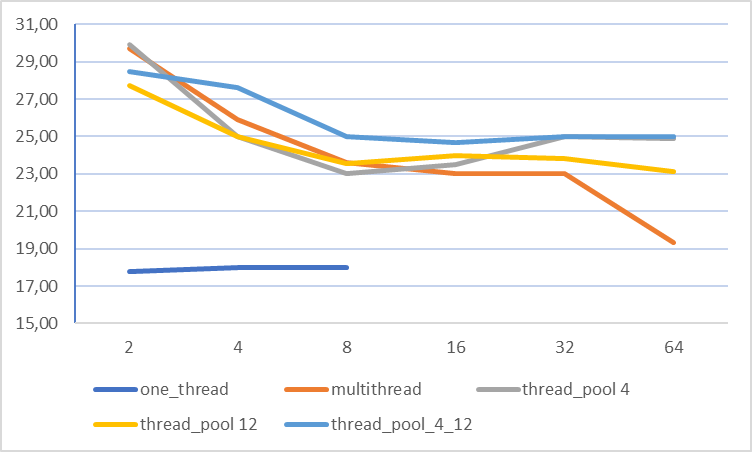
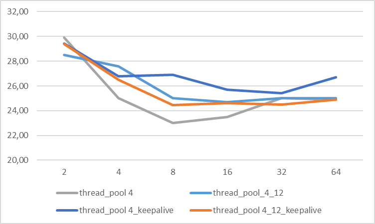
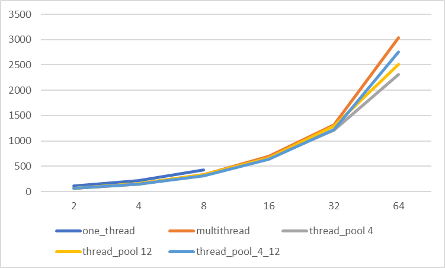

## RPS
| parallels |	2|	4|	8|	16|	32|	64|
|-----|---|---|---|---|---|---|
| one_thread |	17,80|	18,00|	18|
| multithread |	29,70|	25,90|	23,6|  23,00|	23,00|	19,32|
| thread_pool_4 |	29,90|	25,00|	23,00|	23,50|	25,00|	24,90|
| thread_pool_12 |	27,70|	25,00|	23,55|	23,98|	23,80|	23,10|
| thread_pool_4_12 |	28,50|	27,60|	25|	24,70|	25,00|	25,00|
| thread_pool_4_keepalive |	29,44|	26,80|	26,9| 25,70|	25,40|	26,70|
| thread_pool_4_12_keepalive |	29,40|	26,50|	24,47|	24,60|	24,50|	24,90|

## AVG time
|parallels | 2 | 4 | 8 | 16 | 32 | 64 |
|-----|---|---|---|---|---|---|
|one_thread|	111|	220|	426|			
|multithread|	67,00	|153	|334	|693	|1313	|3044|
|thread_pool 4|	66	|154	|340	|664	|1212	|2309|
|thread_pool 12|	71,00|	158	|336	|657	|1291|	2508|
|thread_pool_4_12|	70|	144|	317|	638|	1225|	2760|
|thread_pool 4_keepalive|	67,77|	147|	295|	562|	1198|	2147|
|thread_pool 4_12_keepalive| 67,80|	150| 324 |640|1249|2330|

## Выводы
1. Однопоточный вариант по понятным причинам выдает 18 рпс вне зависимости от нагрузки (правда при слишком большом количестве потоков нагрузки в принципе переставал работать)
2. Вариант с созданием нового потока при каждом запросе от клиента работает примерно на том же уровне, что и тредпул, но при большом количестве клиентских запросов (64 parallels) начинает существенно проседать по эффективности, т.к. переключение контекста для 64 потоков на 4х ядерном (8 логических) CPU съедает много времени.
3. Тред-пул с low-high watermark показал в среднем наилучшую эффективность, но несущественно, скорее всего вызвано нагрузкой на CPU сторонними процессами
4. В случае с keepalive-режимом существенных отклонений не наблюдается